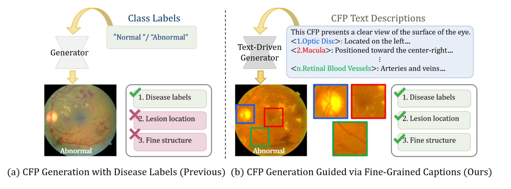
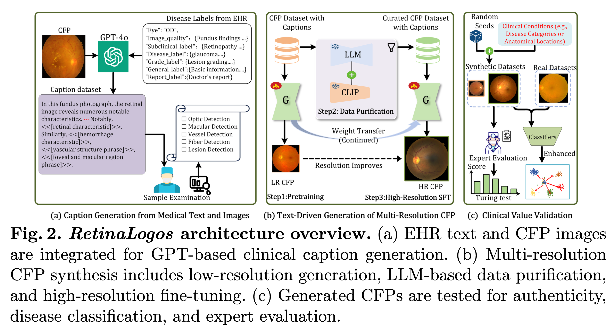
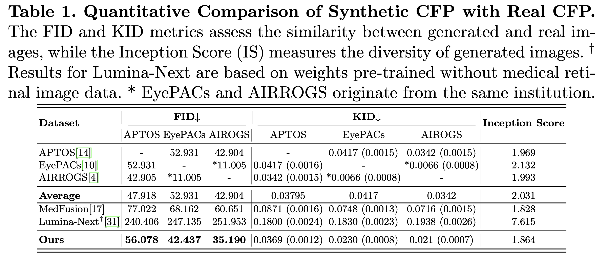
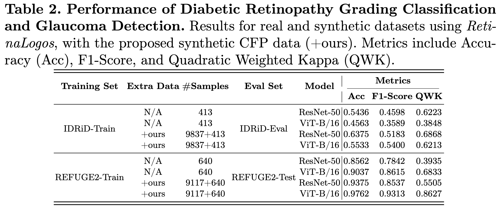
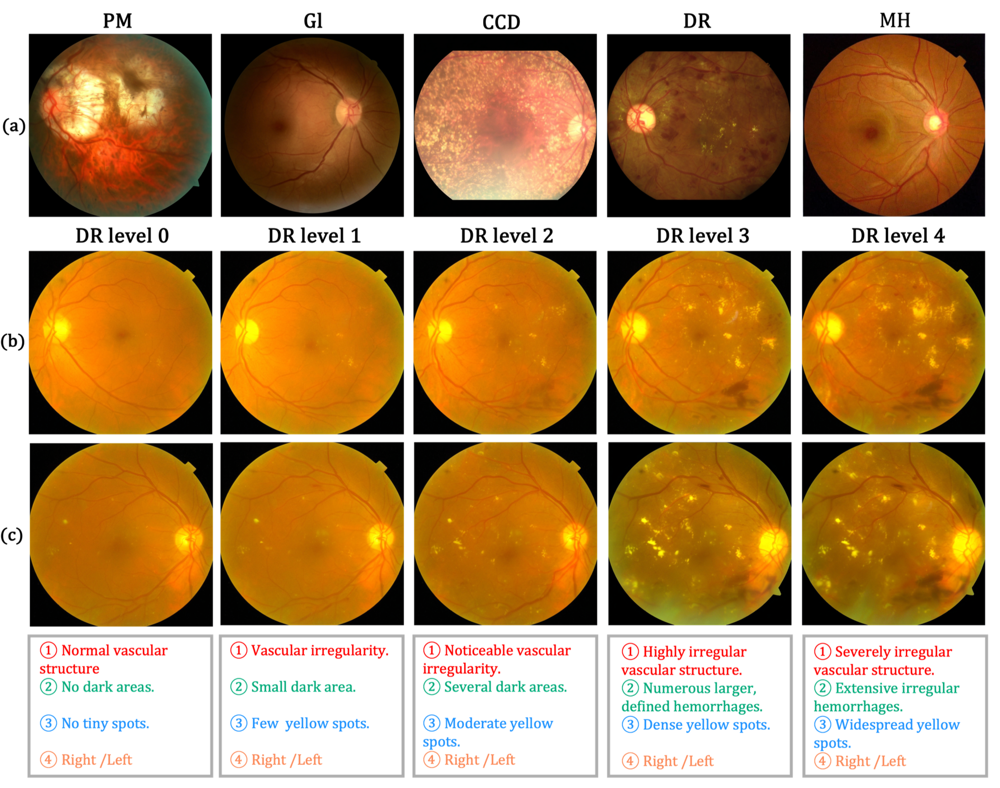
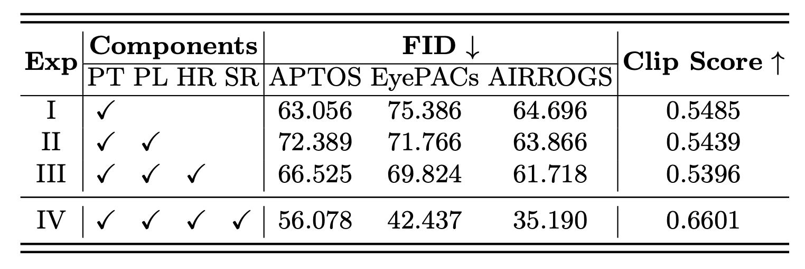
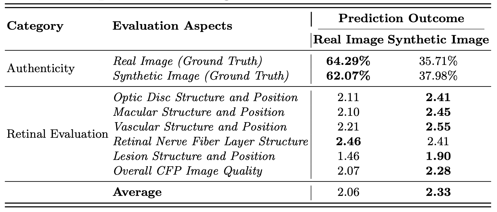
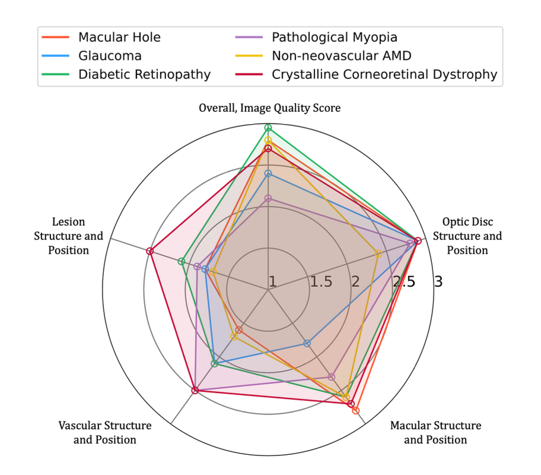

# RetinaLogos: Fine-Grained Synthesis of High-Resolution Retinal Images Through Captions

This document presents the implementation of **RetinaLogos: Fine-Grained Synthesis of High-Resolution Retinal Images Through Captions**, a novel method designed to generate high-resolution Color Fundus Photographs (CFPs) from textual descriptions of retinal conditions. Our method addresses the limitations of existing retinal image synthesis models by providing more detailed and fine-grained control over anatomical structures and disease progression using large-scale text-to-image generation techniques.

## 🌟 Abstract

- **Why Ours Matters? **  
  

The scarcity of high-quality, labeled retinal imaging data presents a significant challenge in ophthalmology. In this work, we introduce **RetinaLogos**, a groundbreaking text-to-image framework that utilizes a large-scale synthetic caption dataset (1.4 million entries) to generate high-resolution retinal images. Our approach combines Electronic Health Records (EHRs) with multimodal text generation, enabling fine-grained semantic control over the generated images. **RetinaLogos** can synthesize retinal images that capture subtle anatomical variations and disease progression, providing valuable insights for early detection and clinical training purposes. Our method demonstrates state-of-the-art performance across multiple datasets, achieving a 10%-25% improvement in classification tasks such as diabetic retinopathy grading and glaucoma detection.

## 🚀 Model Pipelines and Fusion Graphical Illustration:

- **Overview of Method Pipeline**  
  

## Generated CFP Results and Downstream Datasets

- **Quantitative Comparison of Synthetic CFP with Real CFP**  
  

- **Performance of Diabetic Retinopathy Grading Classification and Glaucoma Detection**  
  

## 🖼️ Illustrative Examples:
- **Visual Comparison of Generated CFPs under Different Stages, Resolutions, and Pathological Structures**  
  
  
- **Ablation_Study of RetinaLogos Model using Our Approach**  
  

- **Evaluation of  Real and Sythnetic CFPs**  
  

- **Evaluation of Individual Rare Diseases**  
  

- **More Examples**  
  

## 💡 Highlights

- **Large-Scale Synthetic Dataset**: We assembled a dataset of 1.4 million synthetic retinal caption-image pairs to enable the generation of high-resolution, clinically relevant images.
  
- **Fine-Grained Control**: Our method allows detailed control over retinal anatomical structures and disease stages through free-form textual prompts.
  
- **Superior Performance**: RetinaLogos outperforms existing models in generating clinically accurate and high-quality retinal images.
  
- **Generalizable Framework**: Our framework is versatile and can be applied to a wide range of ophthalmological conditions, supporting future research in medical image synthesis.

## 🚨 Code Release

We hope to make the source code for **RetinaLogos** available upon acceptance of the paper. Please stay tuned for updates, and the code will be shared on our GitHub repository as soon as it is ready.